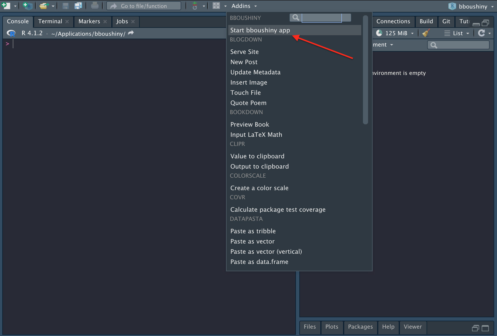

<!-- README.md is generated from README.Rmd. Please edit that file -->

# bboushiny

<!-- badges: start -->

[](https://github.com/poissonconsulting/bboushiny/actions/workflows/R-CMD-check.yaml)
[](https://github.com/poissonconsulting/bboushiny/actions)
<!-- badges: end -->

An R shiny app for estimating Boreal Caribou Population Growth from
survival and recruitment data. `bboushiny` is a simple and easy to use
user interface for the
[`bboutools`](https://github.com/poissonconsulting/bboutools) package.
Check out the
[`bboutools`](https://github.com/poissonconsulting/bboutools) package
which contains more options for customizing the models.

## Usage

### How to Install the R Package

To install the developmental version from
[GitHub](https://github.com/poissonconsulting/bboushiny)

``` r
# install.packages("remotes")
remotes::install_github("poissonconsulting/bboushiny")
```

### How to Launch the App with Code

``` r
# install.packages("bboushiny")
library(bboushiny)
run_bbou_app()
```

### How to Launch the App with RStudio Addins Button

1.  Install the package
2.  Click on the Addins drop-down and select Start bboushiny App



### Overview of How to Use the App

- Download the template for the tab
- Fill in the template with data
- Upload your data and generate an estimate
- Do this for both survival and recruitment
- Generate an estimate for Population Growth
- Download the results


## Contribution

Please report any
[issues](https://github.com/poissonconsulting/bboushiny/issues).

## Code of Conduct

Please note that the bboushiny project is released with a [Contributor
Code of
Conduct](https://contributor-covenant.org/version/2/0/CODE_OF_CONDUCT.html).
By contributing to this project, you agree to abide by its terms.
