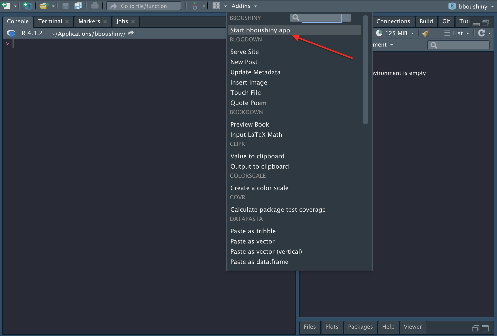
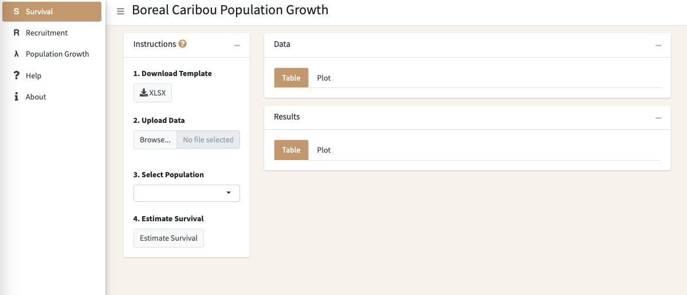

# bboushiny

An R shiny app for estimating Boreal Caribou Population Growth from
survival and recruitment data. `bboushiny` is a simple and easy to use
user interface for the
[`bboutools`](https://github.com/poissonconsulting/bboutools) package.
Check out the
[`bboutools`](https://github.com/poissonconsulting/bboutools) package
which contains more options for customizing the models.

## Usage

### How to Install the R Package

To install the latest version from
[GitHub](https://github.com/poissonconsulting/bboushiny)

``` r
# install.packages("remotes")
remotes::install_github("poissonconsulting/bboushiny")
```

The package must be installed first before the app can be launched.

### How to Launch the App

#### Deployed App

The current working version of the app is available at
<https://poissonconsulting.shinyapps.io/bboushiny/>.

#### Using Code

Run the
[`run_bbou_app()`](https://poissonconsulting.github.io/bboushiny/reference/run_bbou_app.md)
function.

``` r
# install.packages("bboushiny")
library(bboushiny)
run_bbou_app()
```

#### Using RStudio Addins Button

Click on the Addins drop-down and select Start bboushiny App



### Overview of How to Use the App

- Download the data templates for survival and recruitment
- Fill in the template with data
- Upload your data in each tab and generate estimates
- Generate estimates for Population Growth
- Download the results



## bbou Suite

`bboushiny` is part of the bbou suite of tools. Other packages in this
suite include:

- [bboudata](https://github.com/poissonconsulting/bboudata)
- [bboutools](https://github.com/poissonconsulting/bboutools)
- [bbouretro](https://github.com/poissonconsulting/bbouretro)
- [bbousims](https://github.com/poissonconsulting/bbousims)

## Contribution

Please report any
[issues](https://github.com/poissonconsulting/bboushiny/issues).

## Code of Conduct

Please note that the bboushiny project is released with a [Contributor
Code of
Conduct](https://contributor-covenant.org/version/2/0/CODE_OF_CONDUCT.html).
By contributing to this project, you agree to abide by its terms.

## Licensing

Copyright 2022-2023 Integrated Ecological Research and Poisson
Consulting Ltd.  
Copyright 2024 Province of Alberta

The documentation is released under the [CC BY 4.0
License](https://creativecommons.org/licenses/by/4.0/)

The code is released under the [Apache License
2.0](https://www.apache.org/licenses/LICENSE-2.0)
